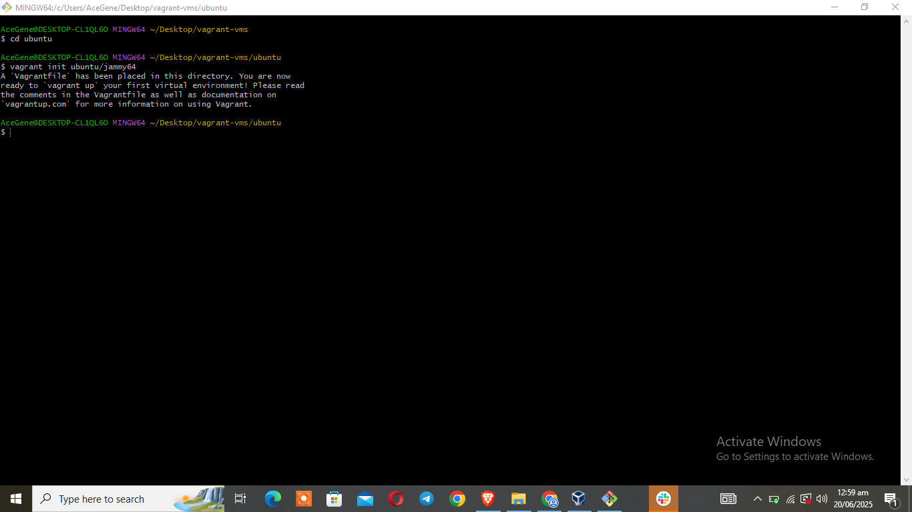
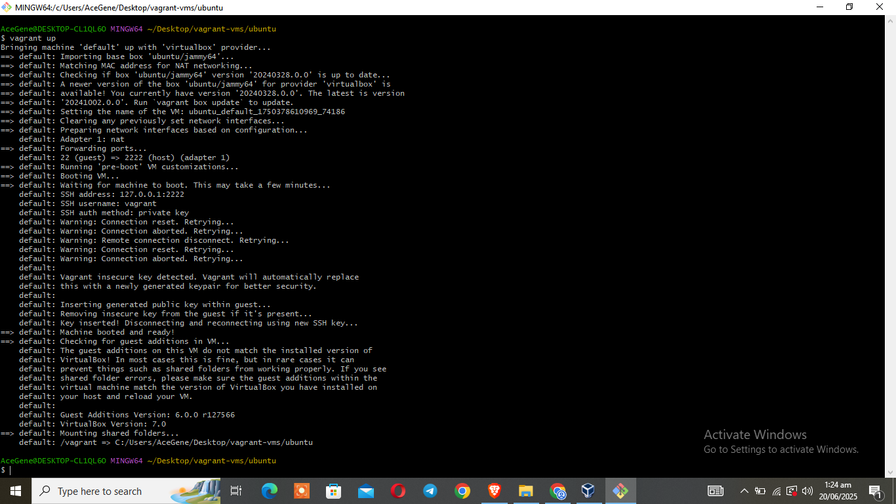
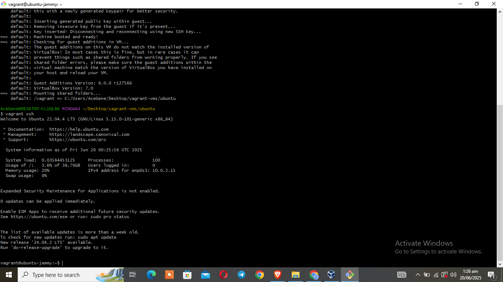
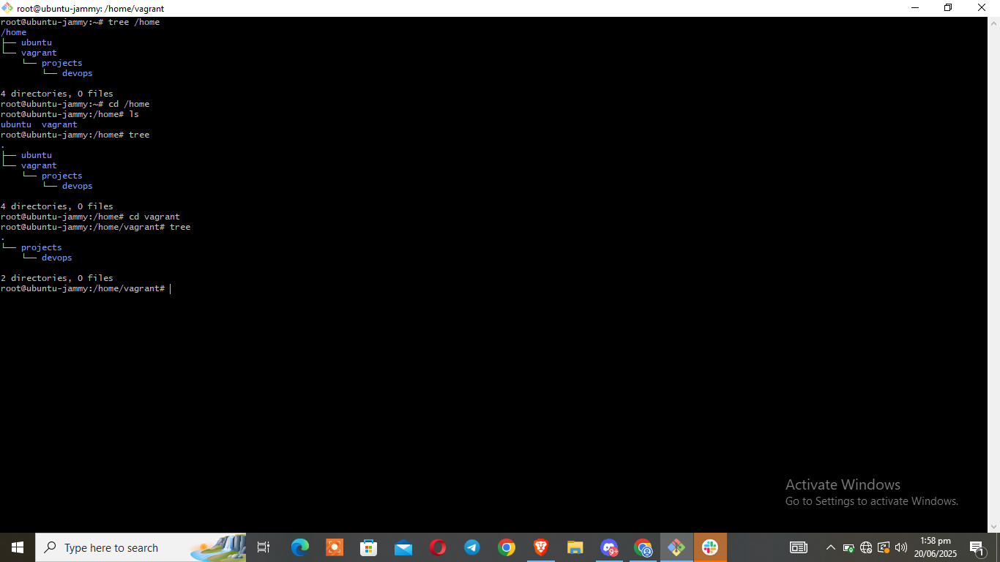
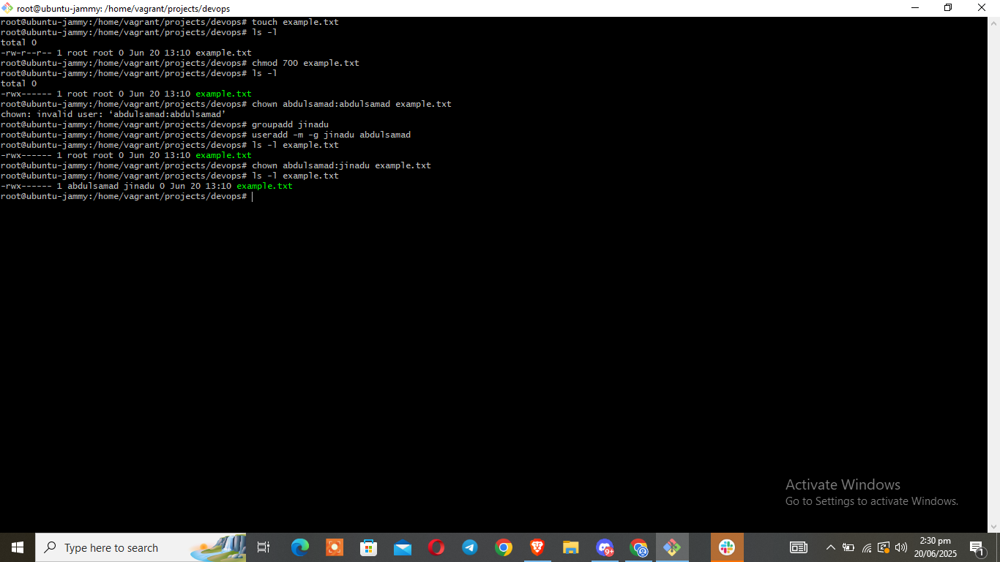
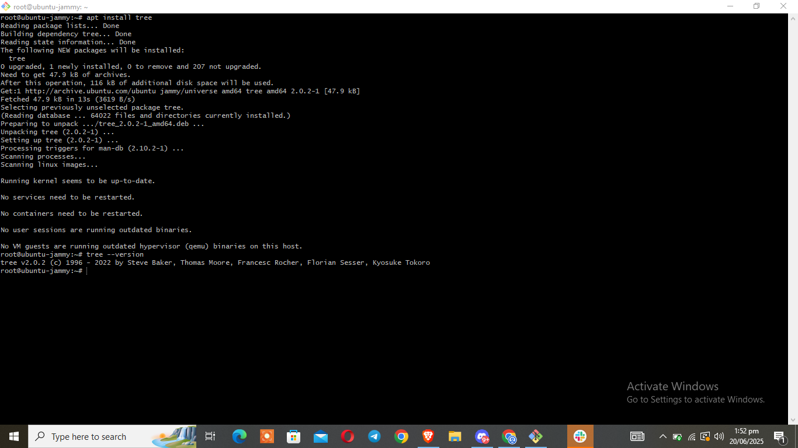
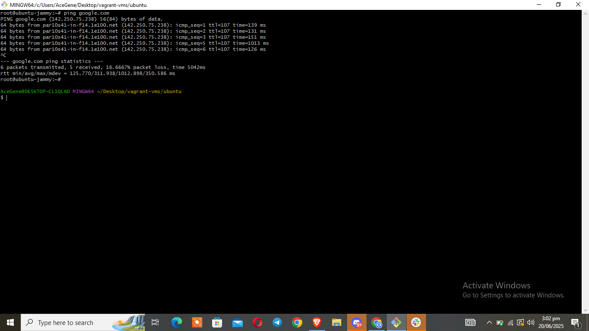

# Linux Fundamentals with Vagrant

This project demonstrates basic Linux system administration tasks using Vagrant and Ubuntu. Tasks include exploring the file system, managing users and permissions, installing packages, and testing connectivity.

---

### Screenshot 1.1 – Vagrant Init

### Screenshot 1.2 – Vagrant Up

### Screenshot 1.3 – Vagrant SSH

**Description:** Initialized Vagrant, started the virtual machine, and SSHed into it.

---

## Screenshot #2 – Folder Structure

**Description:** Created a custom folder structure `/home/vagrant/projects/devops` to organize DevOps projects.

---

## Screenshot #3 – File Permissions and Ownership

**Description:** Created a file `example.txt`, set file permissions to `700`, created a group `jinadu`, created and added user `abdulsamad`.Then assigned `example.txt` to user `abdulsamad`.  
**Explanation:**  
- `rwx------` means only the owner has full access.
- `abdulsamad` is the file owner; `jinadu` is the group.

---

## Screenshot #4 – Package Installation

**Description:** Installed the `tree` package and verified the version.

---

##  Screenshot #5 – Ping Test

**Description:** Used `ping google.com` to test internet connectivity.  
**Why useful:** It confirms the VM can access the internet, which is helpful for troubleshooting networking issues.

---

## Conclusion

This project helped reinforce Linux fundamentals using hands-on Vagrant practice and documentation.
